# UML

## Pràctica 1 : Visual Paradigm
Exercici1

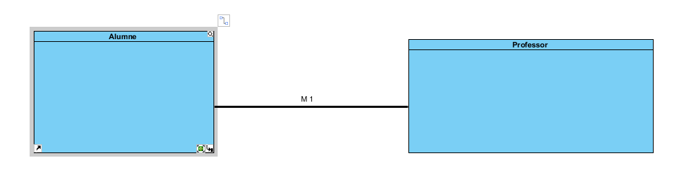

Exercici 2

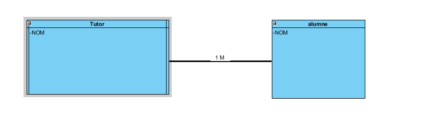

Exercici 3

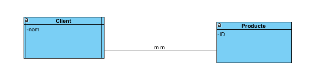

Exercici4

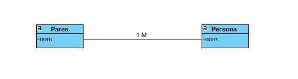

Exercici 5

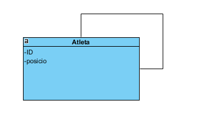

Exercici 6

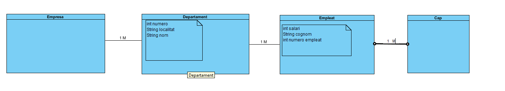

Exercici 7

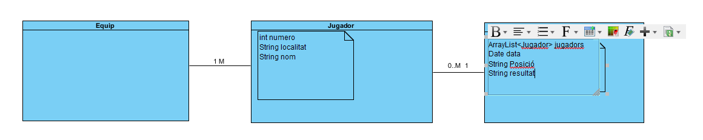

Exercici 8

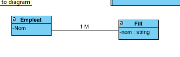

Exercici 9

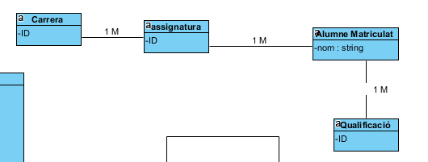

Exercici 10

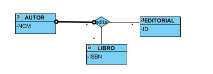

## Pràctica 2 : Papyrus

Exercici 1 i 2

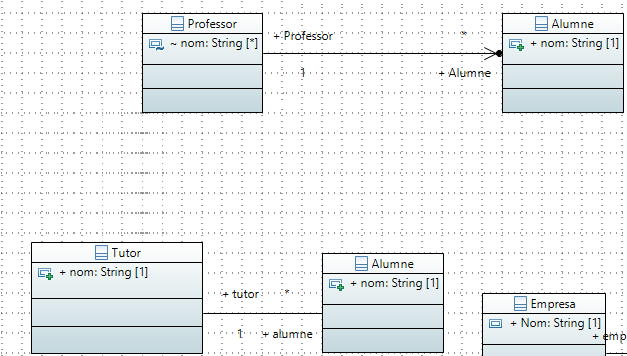

Exercici 3

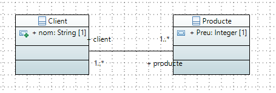

Exercici 4

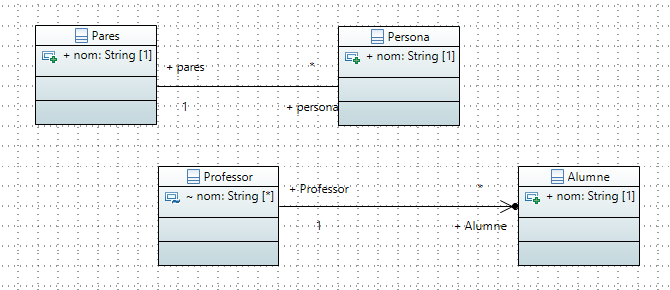

Exercici 5

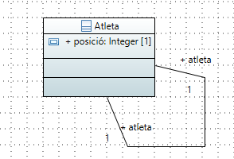

Exercici 6

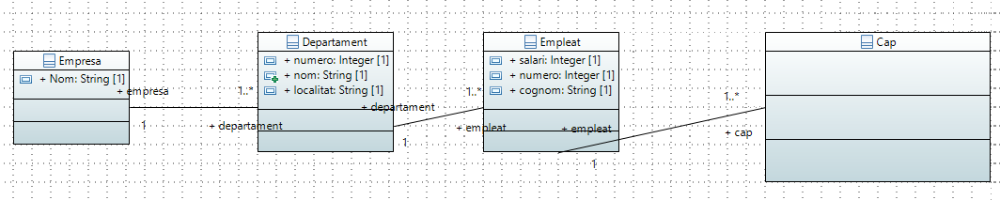

Exercici 7

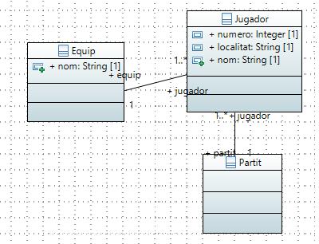

Exercici 8 i 9

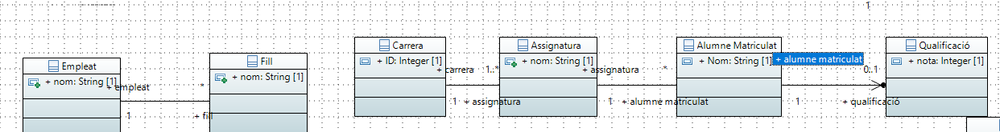

Exercici 10

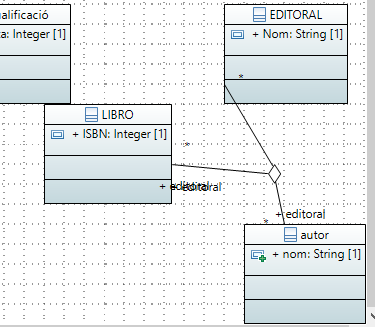